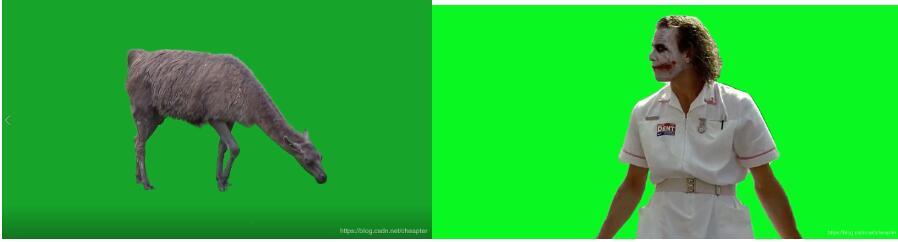
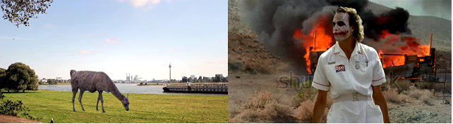
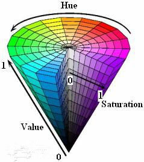
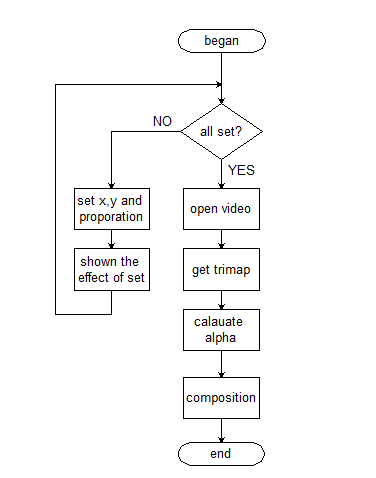
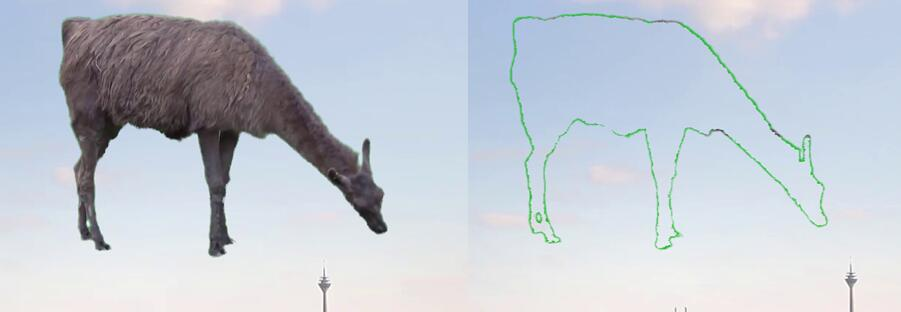
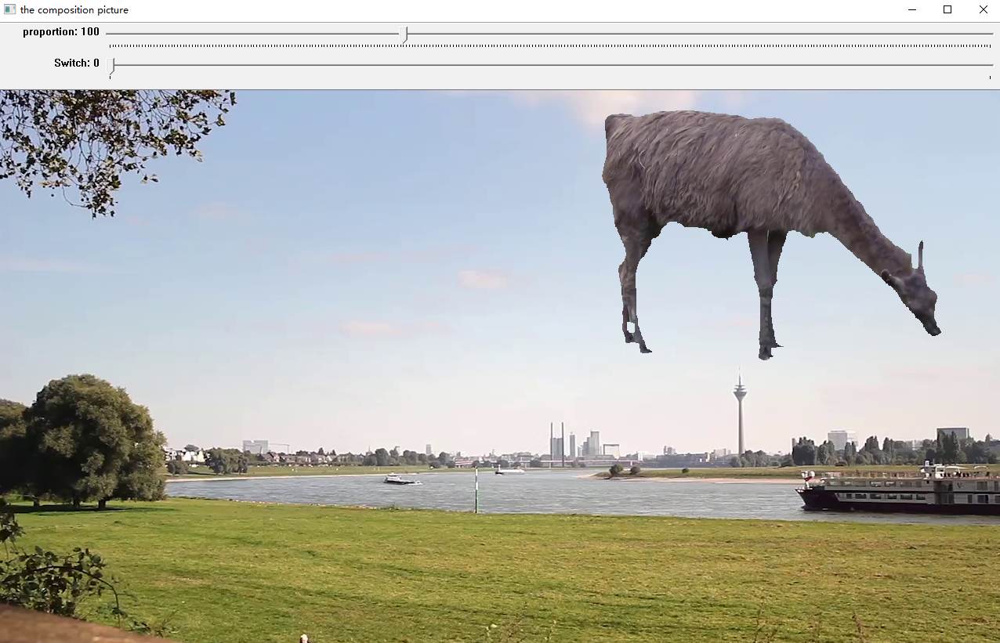
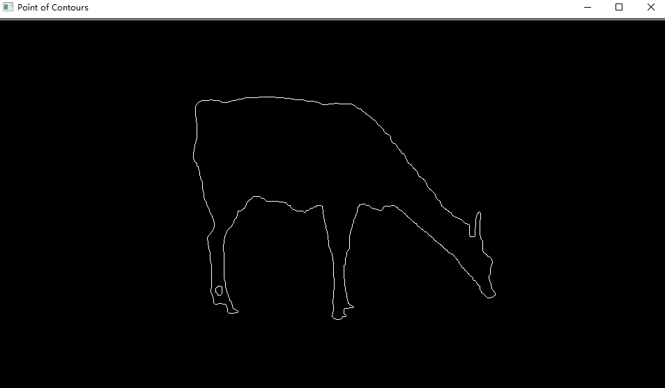
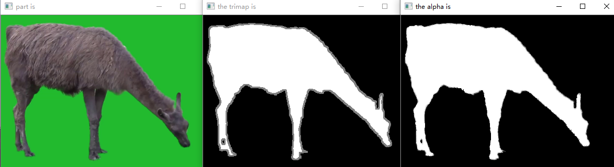
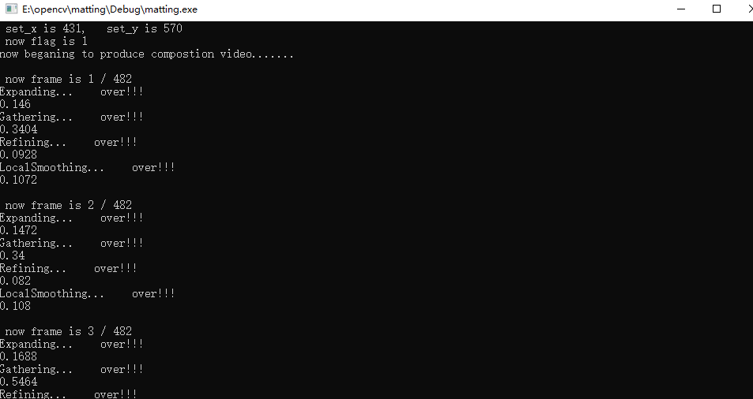
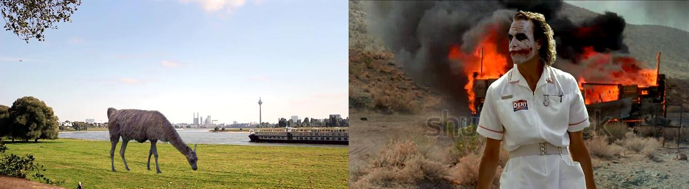

**提前声明本文内容：**
**1. 本文核心算法（alpha求解）基于论文Shared Sampling for Real-Time Alpha Matting进行;
2. 本文对上面论文的核心算法进行了分析；
3. 对于绿色背景的视频进行自动抠图与重新合成；
4. 绿屏视频中（只要是单一颜色背景）的前景目标在新背景上的位置以及大小用户自己设定；
5. 对于光照有较好的鲁棒性；**

---

部分结果展示：

      

      

CSDN 下载：https://download.csdn.net/download/cheapter/10891200
GitHub：https://github.com/CNyuzhang/green-screen-video-matting(welcome to star)

另外说明，代码现在不是太完善，直接下载的代码需要运行的是有闭合轮廓的绿屏视频，对于不闭合（像小丑这个）需要改一下代码，两个函数都写了，调用的时候改一下即可。有问题欢迎讨论~~

---

## 一、研究背景
绿屏抠图广泛用于许多场景，例如视频编辑和合成，制作电视广播等。特别是在在数字技术方面的应用。数字技术允许计算机科学人员研究和开发用于广播的设备，其中虚拟工作室是使用数字技术的成功范例。虚拟工作室的两个主要组件是3D渲染引擎和绿屏消光模块。 3D渲染引擎是根据虚拟摄像机的视图生成背景图像，消光模块是从摄像机获取绿屏视频。获得绿屏视频后，改模块会对视频逐帧进行处理。首先是把绿色背景上的前景图像提取出来，然后将提取出来的图像与产生的虚拟背景进行合成，从而能够实现前景所在背景图像发生改变的过程。

但是合成的图像质量与绿色背景的消除能力有着直接的关系。但是绿屏视频往往存在着大量的干扰信息，例如光照不均匀以及前景目标中也包含绿色成分等。这些限制因素都在制约着合成视频的质量，为了提高合成视频的质量，就要一种比较完善的算法。目前在自然图像的抠图中，有关神经网络以及机器学习的概念被应用的也越来越多[1]。

本课题是处理绿屏视频，相对于自然环境下的抠图还是相对简单，为了提高运算速度，我们尽量采用最简单高效的算法进行抠图。本文最终采用色差法进行第一步处理，然后计算精确alpha值，最终实现输入绿屏视频的自动抠图以及合成功能。同时在视频合成的过程中，我们的算法可以实现前景目标的大小以及位置任意设置，大大提高了算法的实用性。在我们的最终实验中，合成的视频都有较好的效果，而且运算速度也相对较快，说明我们的算法能够取得较好的效果。

## 二、理论分析以及方案确定
#### 2.1 色差法进行图像分割
通过观察绿屏视频发现，只有背景有绿色，前景物体上几乎没有绿色。所以首先考虑是否可以直接根据颜色滤除背景。因为输入图像是RGB格式，其颜色分布空间如左图所示。在RGB空间中进行颜色差异的判断可能效果不明显，所以首先将其转换到HSV颜色空间，HSV颜色空间的颜色分布如右图所示，在进行颜色区分时可以主要依据H通道就可以得到较好的效果。

      

根据颜色差异，对输入图像的颜色进行判断，并以此得到掩膜mask。当原图像中某一像素属于绿色的背景时，令mask中该位置的值为0，否则为255。这样可以得到一张包含前景和背景区域的mask图像，依据这一张图，进行图像的合成。也就是让输出图像在mask为0时的像素值等于背景图像在该点的像素值，否则为绿色背景图片的像素值。这样就能得到一副简单的合成图像。

但是根据色差法进行处理得到输出结果较为突兀，边缘分割明显，前景细节丢失，绿色溢出较为严重。所以这种方法知识和简单分析，没有实际用处。

#### 2.2 基于α图的抠图
在将两张图片进行合成的过程中，为了消除边缘的突变，我们需要在边缘处对图像进行加权叠加。同理，对于前景图像的细节部分，因为其大小可能小于一个像素点，所以也要按照加权的方式进行叠加。这样关键问题就转化为了权重的选取，也就是α值的选择。我们定义α为单个像素的不透明度， $F_p$ 和 $B_p$ 分别为前景和背景像素的颜色值， $C_P$ 为叠加后的像素色彩值，则前景和背景的进行叠加应该满足公式
$$A=\alpha F+(1-\alpha)B$$
在进行抠图与图像合成中，最重要的就是求得alpha在各个像素点处的值。由于我们选择了在绿幕背景下拍摄前景人物的动作，故我们的操作对象具有以下特点：
* 1.背景和前景主体部分容易获得；
* 2.背景和人物分离明显，背景为绿色，且前景人物具有一定的活动范围；
* 3.前景图像边缘的细节，毛发等的alpha值未知。

因此我们需要针对对象特点进行相应的算法设计，可以首先把前景图像从RGB空间转换到HSV空间中，然后对图像进行二值化，接着进行形态学操作后进行滤波，可以得到明显的前景和背景。此时前景中的绿幕的像素值全为0而人物的像素值全为255，而在中间人物边缘和绿幕交接的地方，出现了像素值结于0到255之间的区域，我们称之为未知区域。获取alpha的值，主要任务也就转化为了求解位置区域的alpha的值以及位置区域的大小。对于未知区域的alpha值，我们可以通过选择一对前景和背景点来进行计算。Alpha的计算可以分为以下几个步骤。

##### 获取样本对
这一步主要是找到未知区域中像素点p的候选样本点。为了寻找这些样本点，从p点引出 $K_g$条射线，并记录每条射线碰到的第一个前景或是背景点，否则到图像边界，这样最多可以找到 $K_g$ 个前景点和 $K_g$ 个背景点作为样本点。为了让p临近区域的一点q找到的样本点有较大不同，在p的临近区域的点，其引出的射线按照一定的角度进行偏移。过程如图2.3所示，图中方格内的圆点代表找到的前景点，四方形代表找到的背景点。最多有 $K_g^2$ 个样本对。找到候选样本点，下一步是确定使用哪一对点进行计算。示意图如下：

      

##### 选择样本对
首先分析，若是最后计算出的alpha值合理，则用这个值对前景点和背景点进行重新合成后得到新像素点应该有以下几个特点：
* 1. 重新合成图像与原图像在颜色上的差异小；
* 2. 选择的样本点距离选择点在图像空间上的距离小；
* 3. 重新合成的点在图像空间与原像素点有相似性质。
根据这几个特点，我们可以构造一个目标函数如式：

\[{{g}_{p}}({{f}_{i}},{{b}_{i}})={{N}_{p}}{{({{f}_{i}},{{b}_{i}})}^{{{e}_{N}}}}{{A}_{p}}{{({{f}_{i}},{{b}_{i}})}^{{{e}_{A}}}}{{D}_{p}}{{({{f}_{i}})}^{{{e}_{f}}}}{{D}_{p}}{{({{b}_{i}})}^{{{e}_{b}}}}\]

最佳的样本对应该让2.2 达到最小，也就是选择的样本对满足:

$$({{\hat{f}}_{p}},{{\hat{b}}_{p}})=argmi{{n}_{f,b}}{{g}_{p}}({{f}_{i}},{{b}_{i}})$$

我们用${{M}_{q}}({{F}^{i}},{{B}^{i}})$ 表示用Fi，Bi重新合成的点与原像素点之间的颜色差异，如下式所示。对于合适的样本对，其颜色失真应该很小，也就是${{M}_{q}}(F,B)$的值应该很小。

\[{{M}_{q}}({{F}^{i}},{{B}^{j}})=\left\| {{C}_{p}}-({{{\hat{\alpha }}}_{\text{p}}}{{F}^{i}}+(1-{{{\hat{\alpha }}}_{\text{p}}}){{B}^{j}}) \right\|\]

根据经验以及观察可以发现，在一个像素的临近区域，其颜色变化一般都很小，所以若是选择的样本对合适，其对p的邻域内的其他点也应该有较小的失真，根据最小二乘法原理我们可以得到下式。也就是合适的样本点同样应该使得Np取得较小的值。

\[{{N}_{p}}({{f}_{i}},{{b}_{i}})=\sum\limits_{q\in {{\Omega }_{p}}}{{{M}_{q}}{{({{F}^{i}},{{B}^{j}})}^{2}}}\]

我们定义能量函数为像素点s到达p所需的能量，如式(2.6)所示。由式2.6我们可以知道当||∇I||足够大时，从s逼近p则需要更多的能量。

\[{{E}_{q}}(s)={{\int_{L}{\left\| \nabla I\cdot dr \right\|}}^{2}}={{\int_{p}^{s}{\left\| \nabla I\cdot (\frac{s-p}{\left\| s-p \right\|}) \right\|}}^{2}}\]

如果像素点p到达背景所需的最小能量小于到达前景所需要的最小能量，则可以说像素点p归类于背景的概率更大。根据能量函数EP(S)，可以得到p属于前景的概率估计值如式(2.7).

\[P{{F}_{p}}=\frac{{{\min }_{j}}({{E}_{p}}({{b}_{j}}))}{{{\min }_{i}}({{E}_{p}}({{\text{f}}_{i}})+{{\min }_{j}}({{E}_{p}}({{b}_{j}})))}\]

如果到达前景样本所需的最小能量比到达背景样本所需的最小能量低得多，则 将接近于1，即像素p具有较高的概率属于前景。我们期望 的值与像素归类于背景的概率有关，因此，一个好的样本对也应该尽量使式(2.8)有较小值。
\[{{A}_{p}}({{f}_{i}},{{b}_{i}})=P{{F}_{p}}+(1-2P{{F}_{p}}){{\hat{\alpha }}_{\text{p}}}\]

继续分析图片可以知道，未知区域中像素点p的样本点离p的距离越近越好，定义${{D}_{p}}({{f}_{i}})$ ，${{D}_{p}}({{b}_{i}})$分别为p到前景与背景样本点的距离(图像空间)，所以合适的样本点同时使得${{D}_{p}}({{f}_{i}})$ ，${{D}_{p}}({{b}_{i}})$有较小的值.

经过以上分析，我们可以的到如式(2.2)的目标函数，式(2.2)中的各个指数，在实验中发现分别取${{e}^{N}}=3$ ，${{e}^{A}}=2$，${{e}^{f}}=1$和${{e}^{b}}=4$时有较好的效果。至此，通过目标函数我们可以得到最佳的样本对。

##### 计算alpha的值
选择出了最佳的样本对之后，可以根据这一对样本点来计算alpha的值。参考上文得到alpha可以依据式(2.9)进行计算得到。
\[{{\alpha }_{\text{p}}}=\frac{({{C}_{p}}-{{B}_{p}})({{\text{F}}_{p}}-{{B}_{p}})}{{{\left\| {{\text{F}}_{p}}-{{B}_{p}} \right\|}^{2}}}\]

一旦alpha的值确定之后，我们就可以按照alpha的值对前景图与背景图进行加权叠加，这样就可以实现图像的合成。对于视频，只需要逐帧进行处理并合成即可。

## 三、算法实现与程序设计
经过前面的分析已经我们已经知道alpha具体值的求解方法，在这一章将介绍程序如何设计以及算法的实现。
#### 3.1 总程序设计
系统总体流程图如图3.1所示，首先进行前景目标位置以及大小的设置，设置完毕后开始进行逐帧的处理。首先获得trimap图，也就是包含已知前景、背景以及位置区域的三元图。接着根据trimap与输入原图像进行alpha值的计算。

      

#### 3.2 Trimap 获取
这一步输入前景图像，输出包含三个区域的trimap图，而且此步中对图像进行分割，这样只把包含前景中目标的部分提取出来，会减少计算量提高算法效率。其流程图如图3.2所示。

      

其中获得目标所在区域使用轮廓进行判断。因为二值化之后得到黑白图像，寻找此图像的轮廓，然后判断轮廓大小，滤除过大以及过小的轮廓。然后寻找出轮廓的长宽信息以及最小的x, y值，根据这些信息内即可把轮廓所在区域用一个四方形框起来，也就提取出了目标所在的区域。

最后的形态学操作主要是为了去除掉已知前景和背景中的噪声斑点，同时通过腐蚀与膨胀也能起到改变已知区域大小的作用。形态学运算完毕后对图像进行均值滤波操作，这样目标边缘一部分会变为未知区域，至此，trimap获取完毕。

#### 3.3 alpha计算与图片合成
得到trimap后，便可以根据第二章的分析对alpha进行计算。对于图片合成，需要注意的一点是因为前景图片在之前的处理中进行过分割，所以并不能直接拿前景与新的背景按照alpha进行加权叠加，应该根据用户设置的位置以及大小，合理的调整叠加开始的位置等。

## 四、实验分析与结果
本章主要介绍在实验过程中遇到的一些问题以及最终的实现效果等。
#### 4.1 色差法实验效果

实验效果如图4.1，可以发现最终的输出人物边缘锯齿较为明显。

      

分析可能是因为未知区域太小，所以加大均值滤波的核后继续实验，得到结果如图4.2所示。左边的图像是合成后的图像，观察发现有比较明显的绿边，为了突出绿色边缘，将已知前景去除，可以明显看到边缘有较多的绿边。

      

通过实验发现色差法不能很好的进行绿屏移除，边缘锯齿明显或是绿边明显的问题没有办法得到很好的解决。

#### 4.2 基于α图的抠图
##### 位置以及大小设定
如图4.3，通过滑动图像窗口上方的proportion滑动条可以实现目标的大小变化，直接鼠标单击窗口位置可以将目标放到点击位置。

      

经过大小以及位置调整后的图像如图4.4所示。

      

##### 提取目标区域以及获取alpha
根据二值化后的图像进行轮廓寻找，找到轮廓如图4.5所示，发现图中一共找到了两个轮廓，一个真正的轮廓，还有一个是干扰。所以加入判断，只选择大小满足一定条件的轮廓作为目标轮廓。

      

找到轮廓后，便可以将目标所在的小区域提取出来，进而得到trimap以及alpha图，实验效果如图4.6所示。在实验中发现，trimap选取的不合适会对结果造成较大的影响。所以在结果不满意的时候可以调整trimap的获取过程，一般通过形态学操作以及改变滤波器的核大小进行调整。

      

##### 图片合成结果
得到alpha图之后，剩下的就是进行合成了，下图是对图片进行合成得结果展示

       

下面是视频序列的合成图。

      

对图片进行局部放大得到图4.8，发现在目标的边缘，绿色的突变几乎没有，所以本算法对于合成后的图片，不会给人太突兀的感觉以及绿色的溢出。

      

#### 4.3 视频合成
视频合成其实质和图片合成一样，只不过是视频需要一帧一帧的合成，然后将合成图片的结果进行保存，直至所有视频序列处理完毕。视频处理过程中可以在命令栏里面查看当前处理进度，如图4.9所示。

      

最终本实验合成视频效果较好，如图4.10所示，证明本算法能够有实用价值。

      

<video id="video" controls="" preload="none">
    <source id="mp4" src="../img/matting/1-result.mp4" type="video/mp4">
</video>

## 五 总结与展望
本文讨论的算法，实现了绿屏视频目标的提取以及两个视频的融合，在最终的实验结果中发现能够实现较好的效果。本文重点工作是分析了一种alpha值的计算方法，在这个前提下，寻找了一种自动获取trimap图的方法。并且寻找trimap图的过程可以修改，一满足对不同视频的要求，大大增加了算法的鲁棒性。本文针对算法效率，将绿屏视频中的目标所在区域分割，缩小参与计算图片大小，提高了程序的效率。
但是本设计仍然存在很多缺点，比如对与绿屏中的前景边缘过的细节处理的不是太好，而且算法的执行效率不是太好。未来的工作将围绕这些方面进行努力。

## 参考文献
1. 裴晓康, 王贵锦, 林行刚. 基于模糊估计融合显著性检测的自动抠图算法[J]. 计算机应用研究, 2012, 29(10):3945-3947.
2. Phoka T , Jariyawattanarat W , Sudsang A . Fine tuning for green screen matting[C]// 2017 9th International Conference on Knowledge and Smart Technology (KST). IEEE, 2017.
3. Wen Li.Guoqiang Han.Shengkai Zhang.Xiaoyuan Zhang.An improved robust matting algorithm[J]//Journal of Information & Computational Science 5:5 (2008):2383-2391.
4. Zhu Q , Heng P A , Shao L , et al. What’s the Role of Image Matting in Image Segmentation[C]// IEEE International Conference on Robotics & Biomimetics. IEEE, 2013.
5. Shahrian E, Rajan D, Price B, et al. Improving Image Matting Using Comprehensive Sampling Sets[C]// Computer Vision & Pattern Recognition. 2013.
6. Gastal, E. S., & Oliveira, M. M. (2010, May). Shared sampling for real‐time alpha matting. In Computer Graphics Forum (Vol. 29, No. 2, pp. 575-584). Oxford, UK: Blackwell Publishing Ltd.
7. Xu, Ning, et al. "Deep Image Matting." CVPR. Vol. 2. 2017.

